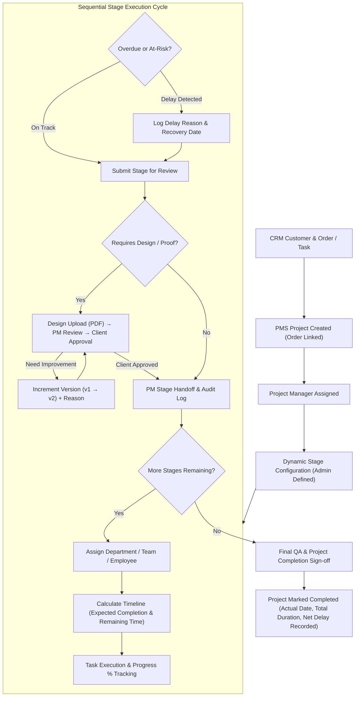

# PROJECT MANAGEMENT SYSTEM (PMS) MODULE
## Stage-Wise Implementation Plan & Technical Architecture Document

> **Document Version:** 1.0.0  
> **Target Framework:** React 19 + Vite 6 + React Router v7 + Tailwind CSS v4 + Lucide React  
> **Environment:** Evenmore Unified ERP / CRM (`c:/Users/EV/Axat_projects/SEWEN/Evenmore-ERP`)  
> **Execution Constraint:** Zero Backend / 100% Frontend Mock & Local Shared State. Existing CRM, HRMS, and ERP code MUST NOT be modified or broken.

---

## Executive Summary & Workflow Pipeline

The PMS (Project Management System) module connects directly into the existing CRM order and lead pipeline. It provides end-to-end operational visibility from the moment a deal/order is confirmed through multi-stage department execution, design proofing, client approvals, quality checks, and project sign-off.



---

## Module Directory Structure (Planned Additions)

All new files will be cleanly encapsulated within the `src/features/pms/` and `src/stores/` namespaces without disturbing existing CRM/HRMS modules:

```text
app/src/
├── features/pms/
│   ├── dashboard/
│   │   ├── PMSDashboard.jsx              # Main KPI & analytics dashboard (/pms)
│   │   ├── components/
│   │   │   ├── PMSKpiSection.jsx         # 7 core metric tiles
│   │   │   ├── ProjectPipelineChart.jsx  # Stage distribution bar/donut
│   │   │   ├── DepartmentWorkload.jsx    # Workload heat and capacity cards
│   │   │   ├── DelayedProjectsTable.jsx  # Quick-action delayed projects list
│   │   │   ├── UpcomingDeadlines.jsx     # Countdown cards for imminent deadlines
│   │   │   └── RecentActivityFeed.jsx    # Live project audit events
│   ├── projects/
│   │   ├── ProjectsPage.jsx              # All projects directory (/pms/projects)
│   │   ├── MyProjectsPage.jsx            # Filtered user-assigned projects (/pms/my-projects)
│   │   ├── ProjectDetailPage.jsx         # Complete 360 detail page (/pms/projects/:id)
│   │   ├── components/
│   │   │   ├── ProjectHeader.jsx         # Project hero banner with completion gauge
│   │   │   ├── ProjectInfoTab.jsx        # Customer, order & contract details
│   │   │   ├── StageTimelineTab.jsx      # Dynamic interactive stage timeline
│   │   │   ├── StageTasksTab.jsx         # Task checklist and allocation
│   │   │   ├── DocumentsProofTab.jsx     # Design PDF version stack & previewer
│   │   │   ├── ApprovalsTab.jsx          # Client approval & revision history
│   │   │   ├── ActivityAuditTab.jsx      # Chronological audit trail
│   │   │   ├── CreateProjectModal.jsx    # New project modal linked with CRM Orders
│   │   │   └── AssignStageModal.jsx      # PM Stage assignment drawer
│   ├── tasks/
│   │   ├── MyTasksPage.jsx               # Individual contributor workbench (/pms/my-tasks)
│   │   └── components/
│   │       ├── TaskFilterBar.jsx         # Priority/Stage/Status task filters
│   │       ├── TaskCardItem.jsx          # Interactive progress slider & status toggle
│   │       └── TaskDetailModal.jsx       # Task edit & sub-checklist modal
│   ├── stages/
│   │   ├── StageConfigPage.jsx           # Dynamic stage configuration (/pms/stages)
│   │   └── components/
│   │       ├── StageListTable.jsx        # Configured stages list with reordering
│   │       ├── AddEditStageModal.jsx     # Dynamic stage builder modal
│   │       └── StageSequenceReorder.jsx  # Up/down sequence adjustment tool
│   ├── timeline/
│   │   ├── TimelinePage.jsx              # Cross-project Gantt & timeline view (/pms/timeline)
│   │   └── components/
│   │       ├── TimelineGanttChart.jsx    # Visual milestone bars with delay highlights
│   │       └── TimelineFilterBar.jsx     # Department & project scope selector
│   ├── delays/
│   │   ├── DelayDashboardPage.jsx        # Dedicated delay resolution board (/pms/delays)
│   │   └── components/
│   │       ├── DelayMetricsRow.jsx       # Overdue count, avg delay duration, bottleneck dept
│   │       ├── DelayResolutionTable.jsx  # Actionable delay table with resolution drawer
│   │       └── LogDelayModal.jsx         # Manual delay reason & recovery date logger
│   ├── reports/
│   │   ├── PMSReportsPage.jsx            # Executive performance reports (/pms/reports)
│   │   └── components/
│   │       ├── OnTimeVelocityReport.jsx  # On-time vs delayed completion trends
│   │       ├── StageBottleneckChart.jsx  # Avg hours spent per stage
│   │       ├── DelayReasonPareto.jsx     # Root cause frequency chart
│   │       └── DepartmentEfficiency.jsx  # SLA compliance by department
│   ├── settings/
│   │   ├── PMSSettingsPage.jsx           # PMS SLA & global configuration (/pms/settings)
│   │   └── components/
│   │       ├── SlaThresholdSettings.jsx  # At-risk threshold percentage & alerts
│   │       ├── ApprovalWorkflowRules.jsx # Required sign-off policies
│   │       └── NotificationDefaults.jsx  # Mock toast & alert preferences
│   └── components/                       # Shared PMS presentation components
│       ├── StageStatusBadge.jsx          # Color-coded badge for 11 stage statuses
│       ├── DynamicProgressBar.jsx        # Dual-tone progress bar with delay marker
│       ├── MockPdfViewer.jsx             # PDF proof viewer with page switcher & annotations
│       ├── ClientApprovalModal.jsx       # Simulated client approval & revision dialog
│       ├── StageHandoffModal.jsx         # Dept-to-Dept submission & PM sign-off modal
│       └── EmptyStatePms.jsx             # Calibrated zero-data illustration & prompts
├── stores/
│   └── pmsStore.js                       # Centralized reactive PMS Zustand store
└── data/
    └── mockPmsData.js                    # Rich initial seed data for projects, stages, tasks
```

---

## Stage-Wise Implementation Plan

```mermaid
gantt
    title PMS Module 12-Stage Implementation Sequence
    dateFormat  X
    axisFormat Stage %d
    
    section Foundation & State
    Stage 1: Centralized State & Domain Models     :0, 1
    Stage 2: Routes & Sidebar Navigation            :1, 2
    Stage 3: Shared UI Components & Badges          :2, 3

    section Core Operations
    Stage 4: Dynamic Stage Configuration Engine     :3, 4
    Stage 5: Master Project Directory & Creation    :4, 5
    Stage 6: Project 360 Detail View & Headers      :5, 6
    Stage 7: Dynamic Stage Timeline & Time Formulas :6, 7

    section Execution & Workflows
    Stage 8: Stage Assignment & Task Execution      :7, 8
    Stage 9: Design Proofing, PDF & Client Approval :8, 9
    Stage 10: Delay Detection & At-Risk Warning     :9, 10

    section Reporting & Governance
    Stage 11: Dedicated Workspaces & Analytics      :10, 11
    Stage 12: Audit Trail, Completion & Polish      :11, 12
```

---

### STAGE 1: Centralized State Management & Domain Architecture

#### Objectives
1. Build the single source of truth (`pmsStore.js`) using Zustand with `localStorage` persistence.
2. Formulate dynamic mathematical recalculation helpers for timelines, delays, remaining hours, and overall project completion percentages.
3. Establish rich initial seed data linking seamlessly to existing CRM customers (`c:/Users/EV/Axat_projects/SEWEN/Evenmore-ERP/app/src/features/crm/leads/mockLeads.js` / ERP parties).

#### Data Schemas & Models

##### 1. Project Entity (`PMSProject`)
```typescript
interface PMSProject {
  id: string;                      // e.g., "PRJ-2026-001"
  crmOrderId: string;              // e.g., "ORD-9402" (links to ERP/CRM Sales Order)
  crmCustomerId: string;           // e.g., "CUST-104"
  customerName: string;            // e.g., "Apex Industrial Technologies"
  productDetails: {
    productName: string;           // e.g., "Custom Heavy CNC Laser Enclosure"
    orderValue: number;            // e.g., 450000 (INR/USD)
    quantity: number;
    specifications: string;
  };
  projectManager: {
    id: string;
    name: string;
    avatar: string;
    email: string;
  };
  currentStageId: string;          // ID of the active stage
  currentDepartment: string;       // e.g., "Design", "Production", "Quality"
  priority: 'Low' | 'Medium' | 'High' | 'Urgent';
  overallCompletionPct: number;    // 0 - 100 (auto-derived)
  startDate: string;               // ISO 8601
  expectedCompletionDate: string;  // Auto-calculated sum of stage durations
  actualCompletionDate: string | null;
  status: 'Draft' | 'In Progress' | 'Delayed' | 'At Risk' | 'Completed' | 'On Hold';
  stages: PMSStageInstance[];      // Ordered stage execution instances
  activityLog: PMSActivityLog[];   // Chronological audit trail
}
```

##### 2. Dynamic Stage Template (`PMSStageConfig`)
```typescript
interface PMSStageConfig {
  id: string;                      // e.g., "stage-cfg-1"
  name: string;                    // e.g., "Design & Prototyping"
  description: string;
  sequence: number;                // 1, 2, 3...
  department: string;              // "Design" | "Production" | "Quality" | "Packaging" | "Installation"
  defaultDuration: number;         // e.g., 3
  durationUnit: 'Hours' | 'Days';
  assignedRole: string;            // "Senior CAD Designer", "Production Engineer", etc.
  requiredApproval: boolean;       // If true, needs Client / PM sign-off
  requiredDocument: boolean;       // If true, needs Design PDF / QA Certificate
  isActive: boolean;
}
```

##### 3. Runtime Stage Instance (`PMSStageInstance`)
```typescript
interface PMSStageInstance {
  id: string;                      // e.g., "stg-inst-01"
  stageConfigId: string;
  name: string;
  sequence: number;
  department: string;
  assignedTeam: string | null;
  assignedUser: {
    id: string;
    name: string;
    email: string;
  } | null;
  completionPct: number;           // 0 - 100%
  plannedDuration: number;         // Copied from config or customized
  durationUnit: 'Hours' | 'Days';
  startDateTime: string | null;    // ISO 8601 when started
  expectedCompletionDateTime: string | null;
  actualCompletionDateTime: string | null;
  status: 
    | 'Not Started'
    | 'Assigned'
    | 'In Progress'
    | 'At Risk'
    | 'Delayed'
    | 'Submitted'
    | 'Under Review'
    | 'Approved'
    | 'Need Improvement'
    | 'Completed'
    | 'Blocked';
  tasks: PMSTask[];
  documents: PMSDocument[];
  approvals: PMSApprovalRecord[];
  delayDetails?: {
    isDelayed: boolean;
    reason: string;
    responsibleDepartment: string;
    responsibleUser: string;
    delayStartDateTime: string;
    expectedRecoveryDate: string;
    resolutionNotes: string;
  };
}
```

##### 4. Task Entity (`PMSTask`)
```typescript
interface PMSTask {
  id: string;                      // e.g., "TSK-1001"
  stageId: string;
  projectId: string;
  taskName: string;
  description: string;
  assignedUser: { id: string; name: string };
  department: string;
  startDate: string;
  dueDate: string;
  completionPct: number;           // 0 - 100%
  priority: 'Low' | 'Medium' | 'High' | 'Urgent';
  status: 'Not Started' | 'In Progress' | 'Blocked' | 'Completed';
}
```

##### 5. Design Proof & Versioning Entity (`PMSDocument`)
```typescript
interface PMSDocument {
  id: string;
  version: number;                 // 1, 2, 3...
  fileName: string;                // "CNC_Enclosure_v1.0.pdf"
  fileSize: string;                // "4.2 MB"
  previewUrl: string;              // Mock PDF/image URL
  uploadedBy: { id: string; name: string };
  uploadedAt: string;              // ISO 8601
  comments: string;
  approvalStatus: 'Pending' | 'Approved' | 'Need Improvement';
  revisionReason?: string;         // Mandatory if Need Improvement
}
```

#### Core Mathematical Formulas in Store

$$\text{Expected Completion Date} = \text{Start Date} + \text{Planned Duration (Hours / Days)}$$

$$\text{Remaining Time} = \max\left(0, \text{Expected Completion Date} - \text{Current Time}\right)$$

$$\text{Delay Duration} = \max\left(0, \text{Current Time (or Actual Completion)} - \text{Expected Completion Date}\right)$$

$$\text{Stage Completion \%} = \begin{cases} 
\frac{\sum \text{Task Completion \%}}{\text{Total Tasks}} & \text{if stage has tasks} \\
\text{Direct Stage \% value} & \text{if stage has no tasks}
\end{cases}$$

$$\text{Overall Project Completion \%} = \frac{\sum_{i=1}^{N} \text{Stage Completion \%}_i}{N}$$
*(Where $N$ is the total count of required stages).*

---

### STAGE 2: Routing Architecture & Navigation Integration

#### Objectives
1. Configure React Router v7 routes under the `/pms/*` prefix inside `routes/index.jsx`.
2. Add the PMS navigation section to `components/layout/Sidebar.jsx` without altering existing CRM, HRMS, Sales, or Inventory routes.
3. Wrap all PMS pages in `PageLoadingSkeleton` and `ErrorBoundary` for high resiliency.

#### Defined PMS Routes

| Path | Component | Description |
| :--- | :--- | :--- |
| `/pms` | `PMSDashboard` | Central KPI dashboard & analytics overview |
| `/pms/projects` | `ProjectsPage` | Searchable & filterable all-projects master directory |
| `/pms/projects/:id` | `ProjectDetailPage` | 360 project detail view (Timeline, Tasks, PDF, Approvals) |
| `/pms/my-projects` | `MyProjectsPage` | Scoped list of projects managed by current logged-in user |
| `/pms/my-tasks` | `MyTasksPage` | Actionable task checklist for department assignees |
| `/pms/stages` | `StageConfigPage` | Dynamic stage configuration & workflow ordering |
| `/pms/timeline` | `TimelinePage` | Cross-project Gantt milestone timeline view |
| `/pms/delays` | `DelayDashboardPage` | Dedicated overdue & at-risk delay resolution desk |
| `/pms/reports` | `PMSReportsPage` | High-level delivery velocity & SLA analytics |
| `/pms/settings` | `PMSSettingsPage` | SLA thresholds, revision policies & preferences |

#### Sidebar Navigation Specification

Add to `components/layout/Sidebar.jsx` immediately after the CRM section:

```javascript
{
  label: 'PMS (Projects)',
  icon: Briefcase,
  badgeKey: 'pmsActiveCount', // Shows live badge of active projects
  children: [
    { label: 'PMS Dashboard', icon: Home, to: '/pms' },
    { label: 'All Projects', icon: Layers, to: '/pms/projects' },
    { label: 'My Projects', icon: UserCheck, to: '/pms/my-projects' },
    { label: 'My Tasks', icon: ListChecks, to: '/pms/my-tasks', badgeKey: 'pmsMyTasksPending' },
    { label: 'Dynamic Stages', icon: Sliders, to: '/pms/stages' },
    { label: 'Timeline & Gantt', icon: Calendar, to: '/pms/timeline' },
    { label: 'Delay Center', icon: AlertTriangle, to: '/pms/delays', badgeKey: 'pmsDelayedCount', badgeColor: '#ef4444' },
    { label: 'PMS Reports', icon: PieChart, to: '/pms/reports' },
    { label: 'PMS Settings', icon: Settings, to: '/pms/settings' },
  ],
}
```

---

### STAGE 3: Shared PMS Presentation & Reusable Component Library

#### Objectives
1. Maximize reuse of existing components:
   - `DataTable.jsx` (sorting, pagination, column rendering)
   - `Modal.jsx` and `Drawer.jsx` (slide-overs, creation dialogs)
   - `StatusBadge.jsx` (pill indicators)
   - `ProgressBar.jsx` (visual progress)
   - `EmptyState.jsx` and `Skeleton.jsx`
2. Create specialized, reusable PMS UI blocks adhering strictly to the design system:
   - Primary: `#1f6bff` (Navy/Blue theme)
   - Surface: `#ffffff` cards on `#f6f9ff` page background
   - Borders: `#dce5f4` subtle border with 8px–12px radius
   - Spacing: Strict 8px grid (8px, 16px, 24px, 32px)

#### Key PMS Reusable Components

##### 1. `StageStatusBadge.jsx`
Supports 11 dynamic statuses with distinct enterprise tokens:
- **Not Started**: Slate background (`#f1f5f9`), slate text (`#475569`)
- **Assigned**: Sky background (`#e0f2fe`), sky text (`#0369a1`)
- **In Progress**: Blue background (`#e0e7ff`), blue text (`#3730a3`)
- **At Risk**: Amber background (`#fef3c7`), amber text (`#92400e`), with pulsing warning icon
- **Delayed**: Rose background (`#ffe4e6`), rose text (`#9f1239`), with alert icon
- **Submitted**: Purple background (`#f3e8ff`), purple text (`#6b21a8`)
- **Under Review**: Indigo background (`#e0e7ff`), indigo text (`#3730a3`)
- **Approved**: Emerald background (`#d1fae5`), emerald text (`#065f46`), checkmark
- **Need Improvement**: Orange background (`#ffedd5`), orange text (`#9a3412`), refresh icon
- **Completed**: Green background (`#dcfce7`), green text (`#166534`), double check
- **Blocked**: Red background (`#fee2e2`), red text (`#991b1b`), lock icon

##### 2. `DynamicProgressBar.jsx`
- Displays percentage text, smooth CSS transition.
- Changes color based on status: Green (on track), Amber (at risk), Red (delayed).
- Supports tooltip showing remaining hours and planned duration.

##### 3. `ActivityTimeline.jsx`
- Chronological vertical step layout.
- Icon nodes for Created, Assigned, Uploaded, Reviewed, Approved, Delayed, Completed.
- Displays user avatar, timestamp, previous value $\rightarrow$ new value, and contextual comments.

---

### STAGE 4: Central Executive PMS Dashboard (`/pms`)

#### Objectives
1. Deliver an executive command dashboard for Project Managers and department heads.
2. Ensure every single metric derives reactively from `pmsStore.js` (no static or fake counts).

```
+----------------------------------------------------------------------------------------------------+
|  PMS DASHBOARD                                                         [ + Create New Project ]    |
+----------------------------------------------------------------------------------------------------+
|  [ Total: 42 ]  [ Active: 28 ]  [ Completed: 12 ]  [ Delayed: 2 ]  [ At-Risk: 3 ]  [ Due Wk: 5 ]   |
+----------------------------------------------------------------------------------------------------+
|                                                  |                                                 |
|  PROJECT PIPELINE BY STAGE                       |  DEPARTMENT WORKLOAD & ACTIVE TASKS             |
|  - Design:      [======      ] 8 Projects        |  - Design Team:       14 Tasks (82% Cap)        |
|  - Production:  [==========  ] 12 Projects       |  - CNC Workshop:      19 Tasks (95% Cap - High) |
|  - Quality QA:  [====        ] 5 Projects        |  - Quality Lab:        6 Tasks (45% Cap)        |
|  - Packing:     [==          ] 3 Projects        |  - Dispatch/Freight:   4 Tasks (30% Cap)        |
|                                                  |                                                 |
+----------------------------------------------------------------------------------------------------+
|                                                  |                                                 |
|  DELAY WATCHLIST & ACTION ALERTS                 |  RECENT PROJECT ACTIVITY STREAM                 |
|  [!] PRJ-004 | Enclosure v2 | +2.5 Days Overdue  |  - Designer Anita uploaded v2.1 for PRJ-002     |
|      Reason: Client Revision (Design Lab)        |  - PM Rajesh assigned Stage 2 to Workshop B     |
|  [!] PRJ-009 | Motor Base   | +12 Hours Overdue  |  - Client "Apex Tech" approved Design Proof     |
|      Reason: Material Issue (SLA Alert)          |  - QA Team flagged PRJ-007 as "Under Review"    |
|                                                  |                                                 |
+----------------------------------------------------------------------------------------------------+
```

#### Metrics & Derived Queries
- `totalProjects`: Count of all projects in store.
- `activeProjects`: Status is `In Progress`, `At Risk`, or `Delayed`.
- `completedProjects`: Status is `Completed`.
- `delayedProjects`: Count of projects where `status === 'Delayed'` or any stage is overdue.
- `atRiskProjects`: Count of stages with $>70\%$ time elapsed but $<50\%$ completion.
- `dueTodayCount`: Expected completion timestamp falls within the current calendar day.
- `dueThisWeekCount`: Expected completion within next 7 days.

---

### STAGE 5: Master Project Directory & Creation Workflow (`/pms/projects`)

#### Objectives
1. Provide a data-dense, paginated table listing all company projects with multi-parameter filtering.
2. Provide a "Create Project" modal linked directly with existing CRM Orders/Leads.
3. Build the `/pms/my-projects` view that automatically filters projects where `projectManager.id === currentUser.id`.

#### Project Directory Table Specifications

| Column | Field / Display | Interactive Feature |
| :--- | :--- | :--- |
| **Project ID** | `id` (e.g. `PRJ-2026-001`) | Direct link to `/pms/projects/:id` |
| **Customer** | `customerName` | Displays CRM Customer pill with search |
| **Order / Item** | `crmOrderId` + `productName` | Tooltip with order value & specs |
| **Project Manager**| Avatar + Name | Filterable PM dropdown |
| **Current Stage** | Stage name pill with sequence badge | Displays sequence e.g., "Stage 2/4: Production" |
| **Department** | Department badge | Color-coded department tag |
| **Completion %** | `DynamicProgressBar` + numeric % | Auto-derived from stage progress |
| **Start Date** | Format `DD MMM YYYY` | Sortable column |
| **Expected End** | Format `DD MMM YYYY` + remaining time | Displays "In 3 days" / "Overdue" |
| **Delay** | Badge: "+1.5 Days" or "On Time" | Red badge if $>0$ delay hours |
| **Priority** | Low, Medium, High, Urgent | Standard CRM priority color pills |
| **Status** | `StageStatusBadge` | Status filter |
| **Actions** | Action dropdown / icon row | View Details, Quick Assign, Log Delay |

#### Multi-Facet Filter Bar
- **Global Search**: Matches Project ID, Customer name, Order ID, and Product Name.
- **Customer Dropdown**: Dynamic distinct list of CRM customers.
- **PM Dropdown**: Filter by assigned Project Manager.
- **Department Dropdown**: Filter by active stage department.
- **Stage Dropdown**: Filter by specific stage name.
- **Status Filter**: Multi-select pills (All, In Progress, Delayed, At Risk, Completed).
- **Delayed Only Toggle**: Quick toggle switch to view only overdue projects.
- **Date Range Picker**: Filter by Start Date or Expected Completion Date.

#### Create Project from CRM Order Modal
- **CRM Order Selector**: Dropdown showing active CRM Sales Orders (e.g., `ORD-9402 - Apex Tech (₹4,50,000)`). Selecting auto-fills Customer, Product Details, and Order Value.
- **Project Name & Code**: Auto-generated sequential code `PRJ-YYYY-XXX`.
- **Project Manager**: Dropdown of eligible PMs.
- **Priority**: Selection of Low / Medium / High / Urgent.
- **Stage Template Picker**: Automatically loads active stage templates configured in Stage 4.
- **Start Date**: Date-time picker (defaults to today).
- **Validation**:
  - Requires CRM Order selection.
  - Requires Project Manager.
  - Automatically initializes all configured active stages in `Not Started` status.
  - Automatically logs `Project Created` in the audit trail.

---

### STAGE 6: Dynamic Stage Configurator & Workflow Engine (`/pms/stages`)

#### Objectives
1. Build a configuration console so administrators can define, order, edit, and deactivate stage templates dynamically.
2. Prevent hardcoding stages: newly created projects must instantiate their stages from this active configuration list.

#### Stage Configuration Capabilities

```
+----------------------------------------------------------------------------------------------------+
|  DYNAMIC STAGE MANAGEMENT                                                 [ + Add New Stage ]      |
|  Define standard execution pipelines. Reordering changes future project workflows.                 |
+----------------------------------------------------------------------------------------------------+
|  Seq  | Stage Name          | Department   | Duration | Unit | Role Required   | Approval | Active |
|-------|---------------------|--------------|----------|------|-----------------|----------|--------|
|  1    | Design & Cad 3D     | Design       | 3        | Days | CAD Specialist  | [x] Yes  | [x] On |
|  2    | PM & Client Review  | Management   | 1        | Days | Project Manager | [x] Yes  | [x] On |
|  3    | CNC Fabrication     | Production   | 5        | Days | Plant Engineer  | [ ] No   | [x] On |
|  4    | Quality Inspection  | Quality Lab  | 1        | Days | QA Lead         | [x] Yes  | [x] On |
|  5    | Packaging & Dispatch| Logistics    | 12       | Hours| Dispatch Lead   | [ ] No   | [x] On |
+----------------------------------------------------------------------------------------------------+
```

- **Drag-and-Drop / Step Ordering**: Up/Down buttons to adjust `sequence` order.
- **Add / Edit Stage Modal**:
  - Stage Name (e.g., "Thermal Stress Testing").
  - Description / Scope checklist.
  - Responsible Department (Design, Production, Quality, Logistics, Management, Procurement).
  - Default Duration (integer) & Unit (`Hours` or `Days`).
  - Required Approval toggle (enforces Client or PM sign-off before handoff).
  - Required Document toggle (enforces PDF or inspection sheet upload).
  - Active / Inactive switch.

---

### STAGE 7: Project 360 Detail View & Dynamic Interactive Timeline (`/pms/projects/:id`)

#### Objectives
1. Create the primary workspace for a project, showing full order context, dynamic stage progression, tasks, proofing, approvals, and activity history.
2. Calculate and display real-time timeline metrics per stage: Planned Duration, Start Date/Time, Expected Completion, Actual Completion, Remaining Time, Delay Duration, and Stage Completion %.

#### Page Structure

##### 1. Hero Header Banner
- Breadcrumbs: `PMS / Projects / PRJ-2026-001`.
- Project ID, Customer Name, CRM Order ID, Product Name.
- Priority Pill, Status Badge.
- Radial Gauge or Banner Bar showing **Overall Completion %** (auto-calculated from stage progress).
- Quick Action Buttons: `[ Assign Active Stage ]`, `[ Submit for Review ]`, `[ Log Delay ]`, `[ Complete Project ]`.

##### 2. Tab Navigation
1. **Overview & Order Details** (Customer contact, product specifications, delivery address, order value).
2. **Stage Timeline** (The sequential interactive stage pipeline).
3. **Tasks Checklist** (Stage-wise actionable sub-tasks).
4. **Design Proof & Documents** (Mock PDF proof viewer with version stack).
5. **Client Approvals** (Approval timeline, client responses, revision reasons).
6. **Activity & Audit Trail** (Timestamped record of all mutations).

##### 3. Interactive Stage Timeline Component
Each stage card in the sequential timeline displays:
- **Header**: Sequence number, Stage Name, Department tag, Assigned Employee avatar.
- **Status Indicator**: Dynamic `StageStatusBadge` (11 states).
- **Time Analytics Grid**:
  - *Planned Duration*: e.g., "3 Days (72 Hours)"
  - *Start Time*: e.g., "14 Sep 2026, 09:30 AM"
  - *Expected Completion*: e.g., "17 Sep 2026, 09:30 AM"
  - *Actual Completion*: Timestamp when finished (or "—" if in progress)
  - *Remaining Time / Overdue Ticker*: e.g., `38 Hours Remaining` (Green) or `+14 Hours Overdue` (Red)
- **Progress Section**: Progress bar (0–100%) and task ratio (e.g., `3/4 tasks done`).
- **Required Gate Badges**:
  - `[Requires PDF Upload]` (Shows green check when uploaded)
  - `[Requires Client Approval]` (Shows amber pending / green approved)
- **Action Buttons**:
  - `[Start Stage]`: Activates stage, sets start timestamp.
  - `[Manage Tasks]`: Opens task drawer for this stage.
  - `[Submit Stage]`: Submits stage to PM for handoff to the next department.

---

### STAGE 8: Stage Assignment, Execution & Department Handoff System

#### Objectives
1. Enable Project Managers to assign a stage to a Department, Team, and specific Employee.
2. Implement the sequential Department Handoff protocol:
   $$\text{Current Dept Completes} \longrightarrow \text{PM Review} \longrightarrow \text{Next Dept Starts}$$
3. Record full handoff audit records: From User $\rightarrow$ To User, From Dept $\rightarrow$ To Dept, timestamp, and handoff notes.

#### Assignment Workflow (`AssignStageModal.jsx`)
- **Stage Picker**: Dropdown of stages in the project.
- **Department**: Pre-populated from stage config, editable if needed.
- **Assigned Team / User**: Dropdown of employees matching the required department role.
- **Planned Start Date & Time**: Defaults to current time or predecessor completion time.
- **Planned Duration Override**: Allows custom hours/days for this specific project.
- **On Submit**:
  1. Stage status transitions to `In Progress` (or `Assigned`).
  2. `startDateTime` is stamped.
  3. `expectedCompletionDateTime` is automatically recalculated.
  4. An actionable task is injected into the assigned employee's `/pms/my-tasks` view.
  5. Audit entry logged: *"Rajesh (PM) assigned Stage 2 (Fabrication) to Vikram (Workshop Lead)"*.

#### Stage Handoff Protocol (`StageHandoffModal.jsx`)
- Activated when an active stage reaches 100% completion (or tasks completed).
- Pre-condition Validation:
  - If stage config has `requiredDocument === true`, at least one document must be uploaded.
  - If stage config has `requiredApproval === true`, client/PM approval must be in `Approved` status.
  - Any blocker must be resolved.
- Handoff Dialog:
  - Displays summary of completed stage (duration taken, delays experienced).
  - Selects recipient user/lead in the *Next Sequential Stage*.
  - Handover Notes & Quality Checklist sign-off.
- On Confirm:
  1. Current stage marked `Completed` with `actualCompletionDateTime` recorded.
  2. Next stage sequence in array unlocks and transitions to `Assigned` / `In Progress`.
  3. Overall project completion % re-computes automatically.

---

### STAGE 9: Design Proofing Center, Mock PDF Viewer & Version Stack

#### Objectives
1. Implement the specialized Design Workflow:
   $$\text{Design Assigned} \longrightarrow \text{Designer Uploads Proof} \longrightarrow \text{PM Review} \longrightarrow \text{Send to Client} \longrightarrow \text{Client Approval}$$
2. Strict non-overwriting versioning: Version 1 $\rightarrow$ Version 2 $\rightarrow$ Version 3.
3. Interactive Mock PDF / Proof viewer with side-by-side comment stream.
4. Client Approval Simulator: allows testing both "Approved" and "Need Improvement" (with mandatory revision reason) scenarios.

```
+----------------------------------------------------------------------------------------------------+
|  DESIGN PROOFING & APPROVAL CENTER -- CNC Enclosure v2.0                                           |
+----------------------------------------------------------------------------------------------------+
|  [ Version History ]  |  PROOF PREVIEW (Mock PDF / CAD Renderer)                                  |
|  * v2.0 (Active)      |  +----------------------------------------------------------------------+  |
|    Uploaded 16 Sep    |  |  +----------------------------------------------------------------+  |  |
|    Pending Approval   |  |  |                                                                |  |  |
|                       |  |  |         [ TECHNICAL BLUEPRINT - ENCLOSURE MODEL 400 ]          |  |  |
|  * v1.1               |  |  |         Scale: 1:20 | Material: SS-304 | Sheet: 2mm            |  |  |
|    Need Improvement   |  |  |                                                                |  |  |
|    "Flange too short" |  |  +----------------------------------------------------------------+  |  |
|                       |  +----------------------------------------------------------------------+  |
|  * v1.0               |  ACTIONS:                                                                  |
|    Need Improvement   |  [ Upload New Version ]  [ Send to Client ]  [ Client Approval Portal ]    |
+----------------------------------------------------------------------------------------------------+
```

#### Multi-Version Storage Engine
- When a designer uploads a revision, the store **prepends or appends** a new version object with incremented `version: currentVersion + 1`.
- Past versions are never deleted or mutated.
- Every version record maintains:
  - `version`: e.g. `1`, `2`, `3`
  - `fileName`: e.g. `Enclosure_CAD_v2.pdf`
  - `uploadedBy`: Designer name
  - `uploadedAt`: ISO string
  - `previewUrl`: Mock rendering
  - `approvalStatus`: `Pending` | `Approved` | `Need Improvement`
  - `revisionReason`: Detailed feedback if returned for rework.

#### Client Approval Simulator Modal (`ClientApprovalModal.jsx`)
- Simulates external client interface:
  - Displays customer name, product title, and version preview.
  - Action 1: **Approve Design**
    - Enters approval comments and signer name.
    - Sets version `approvalStatus = 'Approved'`.
    - Unlocks PM handoff to Production stage.
    - Appends entry to `approvals` array.
  - Action 2: **Need Improvement**
    - Requires **Mandatory Revision Reason** (e.g., *"Hole tolerance must be $\pm 0.1$ mm on left bracket"*).
    - Sets version `approvalStatus = 'Need Improvement'`.
    - Stage status resets to `Need Improvement` / `In Progress`.
    - Automatically opens prompt for designer to upload next version.

---

### STAGE 10: Delay Detection Engine & At-Risk Early Warning System (`/pms/delays`)

#### Objectives
1. Implement real-time automated delay detection:
   $$\text{If } (\text{Current Time} > \text{Expected Completion}) \land (\text{Stage Status} \neq \text{Completed}) \implies \text{Status} \leftarrow \text{Delayed}$$
2. Implement early At-Risk heuristics:
   $$\text{If } (\text{Time Elapsed} > 70\% \text{ of Planned}) \land (\text{Completion \%} < 50\%) \implies \text{Status} \leftarrow \text{At Risk}$$
3. Build the dedicated `/pms/delays` dashboard with filtering, root-cause categorization, and recovery date management.

#### Delay Root-Cause Categories
When marking or resolving a delay, users must select from standard industry categories:
- `Client Revision`
- `Client Approval Pending`
- `Design Issue`
- `Resource Unavailable`
- `Production Issue`
- `Quality Issue`
- `Material Issue`
- `Internal Dependency`
- `Other`

#### Delay Center Dashboard Features (`/pms/delays`)
- **Summary Metrics**:
  - *Total Delayed Projects*
  - *Total Delayed Stages*
  - *Average Delay Duration (Hours / Days)*
  - *Primary Bottleneck Department*
- **Filter Bar**: Filter by Project, Department, Stage, Delay Reason, and Date Range.
- **Actionable Delay Grid**:
  - Shows Overdue Time (e.g., `+3 Days 4 Hours`).
  - Shows Responsible Department & Responsible Person.
  - Shows Stated Reason & Expected Recovery Date.
  - Action: `[ Update Recovery Plan ]` or `[ Resolve Delay ]`.

---

### STAGE 11: Dedicated Workspaces & PMS Executive Analytics (`/pms/my-tasks`, `/pms/timeline`, `/pms/reports`)

#### Objectives
1. Build `/pms/my-tasks`: Tailored task execution console for individual contributors (engineers, designers, QA inspectors) across all active projects.
2. Build `/pms/timeline`: Multi-project interactive Gantt timeline displaying stage spans and dependencies.
3. Build `/pms/reports`: Analytics dashboard visualizing project velocity, department efficiency, and SLA compliance.

#### Individual Contributor Workbench (`/pms/my-tasks`)
- Displays all tasks assigned to the current user across all projects.
- Grouped by: **Due Today**, **In Progress**, **Upcoming**, and **Completed**.
- Direct interactions:
  - Slider to update task completion percentage ($0\% \rightarrow 100\%$).
  - Status toggle (`In Progress` $\leftrightarrow$ `Blocked` $\leftrightarrow$ `Completed`).
  - Instant synchronization: updating a task immediately updates the parent stage percentage and the overall project progress.

#### PMS Analytics & Reports (`/pms/reports`)
- **Project Velocity**: On-Time vs Delayed completion percentage donut chart.
- **Stage Bottlenecks**: Bar chart showing average cycle time (days) for Design, Production, QA, and Packaging.
- **Delay Pareto Chart**: Breakdown of delay causes (e.g., $45\%$ Material Delay, $30\%$ Client Revision).
- **Department Capacity**: Workload distribution vs team capacity utilization.

---

### STAGE 12: Activity Audit Trail, Project Completion Sign-Off & Polish

#### Objectives
1. Implement the strict project completion validator:
   $$\text{Project Completed} \iff \text{All Required Stages Completed} \land \text{PM Sign-Off}$$
2. Store immutable project completion metrics: `actualCompletionDate`, `totalDurationDays`, `totalDelayHours`, and `finalCompletionPct: 100%`.
3. Provide complete activity audit trail for all events across the project lifetime.
4. Comprehensive polish: Responsive mobile/tablet support, zero broken buttons, zero Lorem Ipsum, robust empty states, and toast notifications.

#### Audit Event Types Recorded

| Event Action | Recorded Fields |
| :--- | :--- |
| `Project Created` | Created by, linked CRM Order, initial stages count |
| `Stage Assigned` | Stage name, assigned department, user, planned duration |
| `Progress Updated` | Previous %, new %, updated by, timestamp |
| `Design Uploaded` | File name, version number, designer name |
| `Client Approved` | Approver name, version approved, sign-off comments |
| `Revision Requested` | Revision reason, returned to designer, version incremented |
| `Delay Detected / Logged` | Delay reason, overdue duration, recovery date, responsible user |
| `Stage Handoff` | From Department $\rightarrow$ To Department, handover notes |
| `Project Completed` | Actual completion date, total turnaround days, PM sign-off |

---

## Technical Verification & Validation Checklist

Before marking any stage as finished, the implementation must pass the following verification tests:

- [ ] **State Reactivity**: Creating a project instantly updates the project list, PMS dashboard KPI counters, and timeline without page reload.
- [ ] **Dynamic Time Calculation**: Changing a stage's planned duration immediately updates the expected completion date and recalculates delay hours.
- [ ] **Progress Cascade**: Moving a task slider from $50\%$ to $100\%$ updates the stage progress bar, which in turn recalculates the project overall completion percentage.
- [ ] **Design Version Stack**: Uploading a revised PDF creates Version 2 without destroying Version 1 history.
- [ ] **Client Approval Branching**:
  - Selecting "Need Improvement" enforces a revision reason and resets stage to rework.
  - Selecting "Approve" unlocks the PM handoff button.
- [ ] **Overdue Auto-Detection**: Simulating an overdue date automatically flags the stage and project as `Delayed` with red badges.
- [ ] **Project Completion Gate**: A project cannot be marked completed if any required stage is in `Not Started`, `In Progress`, or `Delayed`.
- [ ] **Zero Code Disruption**: CRM Leads, ERP Invoices, Purchase Orders, and HRMS pages remain 100% operational and untouched.
- [ ] **Design System Compliance**: Uses exact design tokens (`#1f6bff`, `#f6f9ff`, `#183153`, 8px grid, Inter font, Lucide icons).

---

## Implementation Stage Roadmap Summary

| Stage | Focus Area | Deliverables |
| :---: | :--- | :--- |
| **Stage 1** | Foundation & Shared Store | `pmsStore.js`, `mockPmsData.js`, state calculation formulas |
| **Stage 2** | Routing & Layout | New routes in `routes/index.jsx`, PMS sidebar menu in `Sidebar.jsx` |
| **Stage 3** | Shared Presentation Components | `StageStatusBadge.jsx`, `DynamicProgressBar.jsx`, `ActivityTimeline.jsx` |
| **Stage 4** | Executive Dashboard | `/pms` Dashboard, KPI cards, pipeline charts, deadline watchlist |
| **Stage 5** | Project Master Directory | `/pms/projects`, `/pms/my-projects`, filters, Create Project modal |
| **Stage 6** | Dynamic Stage Configurator | `/pms/stages`, stage CRUD, duration units, sequence reordering |
| **Stage 7** | Project 360 Detail View | `/pms/projects/:id`, Hero header, sequential interactive timeline |
| **Stage 8** | Stage Assignment & Handoff | Department/employee assignment, task management, PM handoff modal |
| **Stage 9** | Design Proof & Client Approval | Mock PDF viewer, version stack, client approval / revision dialog |
| **Stage 10** | Delay & At-Risk Engine | Overdue auto-detection, `/pms/delays` resolution board, reason logging |
| **Stage 11** | Dedicated Workspaces & Reports | `/pms/my-tasks` workbench, `/pms/timeline`, `/pms/reports` analytics |
| **Stage 12** | Audit Trail & Project Sign-Off | Audit event logger, final completion verification, full responsive polish |
